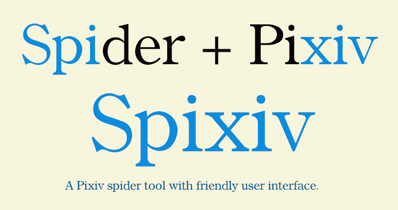

# Spixiv

A Pixiv spider tool with friendly user interface.

您也可以到我的博客下载方便的可执行文件。http://caoyi.site/?p=126

## How to use

请使用 Python3 运行 main.py

Tips：

1. 请保证 Settings.json 文件存在且正确配置
2. 请保证您的计算机可以正常访问外网

## How to setting

在 Settings.json 中可以对 Spixiv 进行一些简单的设置 (默认设置可以正常运行)

1. Spixiv 支持更改爬取页面。当然必须是在 www.pixiv.net 站内，您可以在 "url_list" 后的 list 中更改成您喜欢的页面列表。
2. Spixiv 支持更改预览画质。有 **original**，**regular**，**small**，**thumb**，**mini** 共 5 种选择，您可以在 "preview_img_quality" 后更改关键词。
3. Spixiv 支持更改保存路径。可以是相对路径也可以的是绝对路径，如果文件夹不存在，Spixiv 会自动创建该文件夹，您可以在 "img_save_path" 后更改保存路径。

## About

Python 3.7.6 64bit

PyQt5
